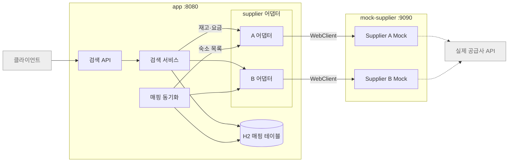
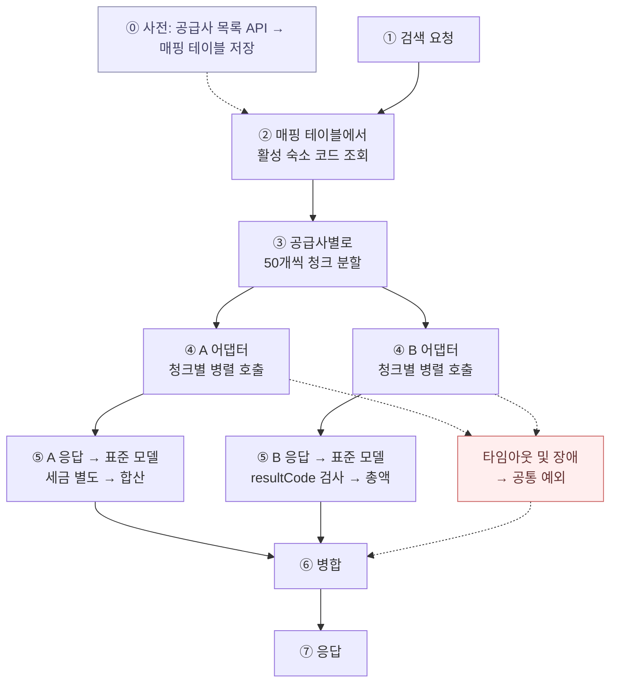

# 아키텍처

## 1. 구성

`app`은 통합 검색 서비스, `mock-supplier`는 공급사 A·B를 흉내내는 서버




## 2. app 계층과 패키지 경계

```
com.stayhub
├── api          검색 컨트롤러, 요청/응답 DTO
├── application  검색 서비스
├── domain       표준 숙박 상품 모델 (공급사를 모르는 상태)
├── supplier     공급사 연동
│   ├── SupplierAdapter (인터페이스)
│   ├── a        A 어댑터, A 응답 DTO, A → 표준 모델 변환
│   └── b        B 어댑터, B 응답 DTO, B → 표준 모델 변환
└── mapping      매핑 엔티티, 리포지토리, 동기화 스케줄러
```

경계 규칙

- 공급사 응답 DTO는 어댑터가 표준 모델로 바꿔서 내보냄
- `application`은 `SupplierAdapter` 인터페이스만 보기 때문에 A인지 B인지 분기하지 않음
- 공급사별 실패(A의 HTTP 상태 코드, B의 resultCode)는 어댑터 안에서 공통 예외로 바뀜

## 3. 검색 흐름




## 4. 매핑 동기화

- 시점: 기동 시 매핑이 비어 있으면 즉시 1회, 이후 주기 갱신 (공급사별로 독립 수행)
- 처리: 어댑터로 목록 API 호출 → 같은 (공급사, 코드)는 같은 내부 식별자를 유지하며 upsert → 목록에서 사라진 상품은 비활성화
- 실패
  - 기본: 기존 매핑 유지
  - 비어 있으면 짧은 간격 재시도
  - 매핑이 없는 공급사는 검색 응답에 상태로 표기
- 매핑 키: 숙소는 (공급사, 숙소 코드), 객실 타입은 (공급사, 숙소 코드, 객실 타입 코드)


## 5. 신규 Supplier 추가 절차

1. `supplier.c` 패키지 생성
2. 응답 DTO, `SupplierAdapter` 구현체, C → 표준 모델 변환
3. C의 실패 표현을 공통 예외로 바꾸는 규칙을 어댑터 안에 작성
4. 설정에 C의 base URL, API 키, 타임아웃 추가
5. `mock-supplier`에 C 엔드포인트와 응답 데이터 추가

## 관련 ADR

- [0001 Gradle 멀티모듈 구조](adr/0001-gradle-multi-module.md)
- [0002 Mock Supplier 구성 방식](adr/0002-mock-supplier.md)
- [0003 Spring MVC 위에서 WebClient만 사용](adr/0003-mvc-with-webclient.md)
- [0004 매핑 저장소와 동기화 전략](adr/0004-mapping-store-and-sync.md)
