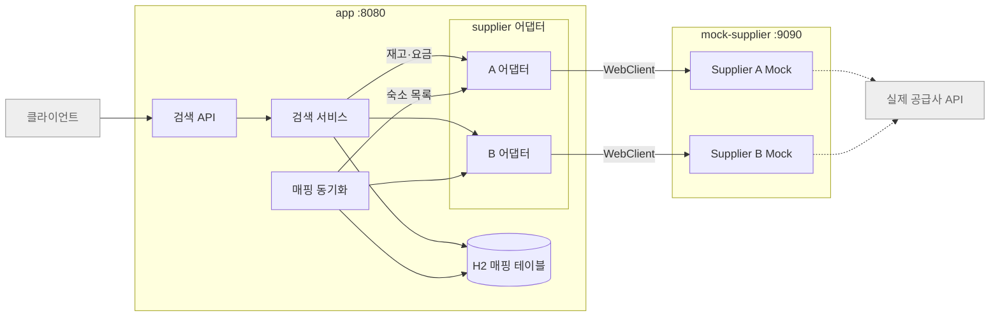
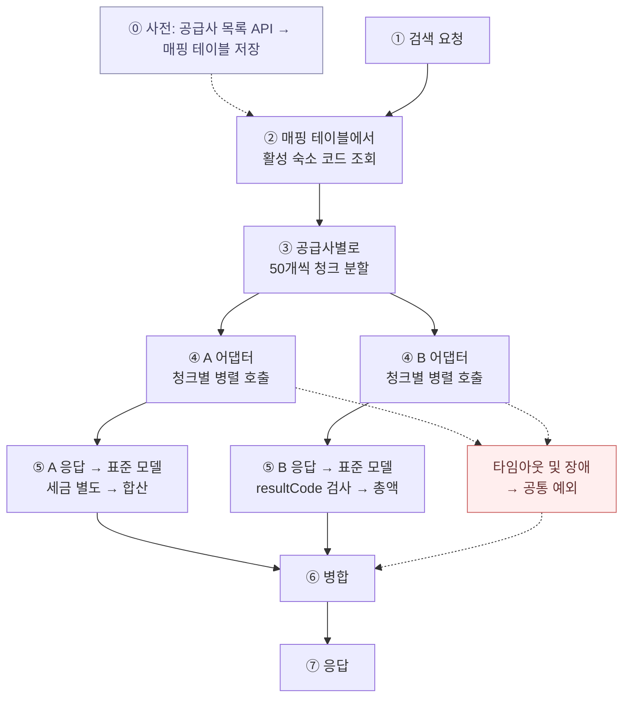

# 아키텍처

## 1. 구성

`app`은 통합 검색 서비스, `mock-supplier`는 공급사 A·B를 흉내내는 서버




## 2. app 계층과 패키지 경계

```
com.stayhub
├── api          HTTP 입구. StaySearchController
├── application  검색 흐름. StaySearchService
├── domain       표준 모델.
├── supplier     공급사 연동. SupplierAdapter 인터페이스, 공급사별 하위 패키지 a·b
└── mapping      공급사 코드 <-> 내부 식별자. MappingSyncService
```

경계 규칙

- 공급사 응답 DTO는 `supplier.a`, `supplier.b` 밖으로 나가지 않음. package-private
- 어댑터는 형식만 표준으로 바꿈. 요금 총액, 가용 객실 수, 조식은 계산하되 식별자는 공급사 코드 그대로인 SupplierOffer를 반환. 내부 식별자, 이름, 최대 인원 결합은 StaySearchService가 매핑 테이블로 수행 (ADR 0007)
- `application`은 `SupplierAdapter` 인터페이스와 `List<SupplierAdapter>`만 봄. A인지 B인지 분기하지 않음
- 공급사별 실패(A의 HTTP 상태 코드, B의 resultCode, 타임아웃)는 어댑터 안에서 SupplierException 하나로 바뀜 (ADR 0008)
- Mono·Flux는 `supplier`와 `application`의 StaySearchService 안에만 있음. `block()`은 StaySearchService.search()에서 한 번 (ADR 0003)

## 3. 검색 흐름




## 4. 매핑 동기화

- 시점: 기동 시 매핑이 비어 있으면 즉시 1회, 이후 주기 갱신 (공급사별로 독립 수행)
- 처리: 어댑터로 목록 API 호출 → 같은 (공급사, 코드)는 같은 내부 식별자를 유지하며 upsert → 목록에서 사라진 상품은 비활성화
- 실패
  - 기본: 기존 매핑 유지
  - 비어 있으면 짧은 간격 재시도
  - 매핑이 없는 공급사는 검색 응답에 상태로 표기
- 매핑 키: 숙소는 (공급사, 숙소 코드), 객실 타입은 (공급사, 숙소 코드, 객실 타입 코드)


## 5. 숙소가 수천 개로 늘면

지금은 숙소가 4개라 공급사당 청크 1개, 호출 2번으로 끝남. 규모가 커지면 검색 한 번의 호출 수가 문제가 됨. (일단 설계만)

### 지금 구조로 계산하면

| 공급사당 숙소 | 청크(50개) | 동시 4개 → 라운드 | 라운드당 0.5초 가정 | 데드라인 5초 |
|---|---|---|---|---|
| 200 | 4 | 1 | 0.5초 | 통과 |
| 1,000 | 20 | 5 | 2.5초 | 통과 |
| 5,000 | 100 | 25 | 12.5초 | 초과. TIMEOUT |

즉 공급사당 1,000개 안팎이 현재 값의 한계. 그 위로는 검색마다 그 공급사가 TIMEOUT으로 빠짐.

### 대응 순서

| 순서 | 대응 | 효과 | 비용                                                                             |
|---|---|---|--------------------------------------------------------------------------------|
| 1 | 공급사별 동시 청크 수 상향 (설정값) | 동시 20이면 5,000개가 5라운드, 2.5초 | 공급사 호출 한도(429) 합의가 먼저. 설정 한 줄이라 가장 쉽지만 우리가 정할 수 없음                             |
| 2 | 재고·요금 짧은 TTL 캐시 | 같은 날짜·인원 검색이 반복되면 공급사 호출 자체가 사라짐 | 재고가 바뀌어도 TTL 동안 옛 값. 예약 직전 재확인이 필요. 캐시 키는 (공급사, 청크, 날짜, 인원)                    |
| 3 | 부분 응답 먼저 내보내기 | 데드라인 안에 끝난 청크만으로 응답하고 그 공급사를 PARTIAL로 표시 | 지금 코드가 이미 청크 단위로 성공/실패를 집계하므로 데드라인 시점에 "미완 청크를 실패로 간주"만 추가하면 됨. 결과가 매번 다를 수 있음 |
| 4 | 검색 조건으로 대상 축소 | 지역·키워드로 매핑을 먼저 걸러 청크 수를 줄임 | 공급사가 지역 정보를 주지 않아 우리가 별도로 확보해야 함. 현재 범위 밖                                      |

1 → 2 → 3 순서로 적용하고 4는 데이터가 생겨야 가능. 1과 3은 지금 코드 구조에서 설정 변경과 몇 줄 추가로 가능하고, 2는 캐시 계층 하나가 새로 생김.

### 바뀌지 않는 것

- 매핑 동기화는 규모와 무관. 목록 API는 조건 없이 전체를 한 번에 주고 주기가 6시간이라 숙소 수가 늘어도 호출 수는 그대로
- 청크 분할, 병렬, 부분 실패 구조는 그대로

## 6. 신규 Supplier 추가 절차

1. `supplier.c` 패키지 생성
2. C 응답 DTO(package-private record), `SupplierAdapter` 구현체, C → CatalogEntry, SupplierOffer 변환 클래스
3. C가 실패를 알리는 방식(HTTP 상태, 본문 코드 등)을 SupplierException + FailureReason으로 바꾸는 규칙을 어댑터 안에 작성
4. application.yaml의 `stayhub.suppliers`에 C의 base-url, api-key, 타임아웃 추가
5. `Supplier` enum에 C 추가
6. `mock-supplier`에 C 엔드포인트와 응답 데이터, 고장 스위치 추가

`api`, `application`, `mapping`은 수정 없음. 어댑터가 `@Component`로 등록되면 `List<SupplierAdapter>` 주입으로 매핑 동기화 스케줄러와 검색 서비스에 자동 포함됨

## 관련 ADR

- [0001 Gradle 멀티모듈 구조](adr/0001-gradle-multi-module.md)
- [0002 Mock Supplier 구성 방식](adr/0002-mock-supplier.md)
- [0003 Spring MVC 위에서 WebClient만 사용](adr/0003-mvc-with-webclient.md)
- [0004 매핑 저장소와 동기화 전략](adr/0004-mapping-store-and-sync.md)
- [0005 표준 숙박 상품 모델](adr/0005-standard-stay-model.md)
- [0006 부분 실패 표현](adr/0006-partial-failure-response.md)
- [0007 어댑터의 책임 범위](adr/0007-adapter-responsibility.md)
- [0008 실패 판정 통일](adr/0008-failure-normalization.md)
- [0009 견고성 설정값과 재시도·서킷 설계](adr/0009-resilience-settings.md)
