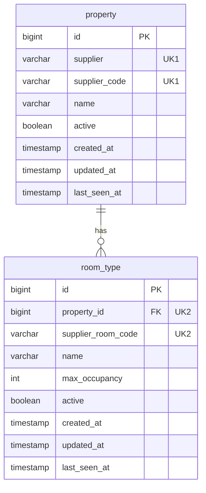

# 도메인 모델

## 1. 개념

상품 단위는 (공급사, 숙소, 객실 타입)

| 개념 | 설명                                             | 저장 |
|---|------------------------------------------------|---|
| 숙소 (Property) | 공급사가 취급하는 숙소 하나. 내부 식별자를 가짐 | 매핑 테이블 |
| 객실 타입 (RoomType) | 숙소 안에서 요금과 재고가 매겨지는 단위. 내부 식별자를 가짐 | 매핑 테이블 |
| 상품 (StayOffer) | 검색 시점의 한 객실 타입에 대한 요금과 재고. 검색마다 공급사 응답을 변환해 만듦 | 저장 안 함 |

## 2. 검색 결과 항목 (StayOffer)

| 필드 | 타입 | 출처          | 설명 |
|---|---|-------------|---|
| propertyId | long | 매핑          | 내부 숙소 식별자 |
| propertyName | string | 매핑          | 숙소명 |
| roomTypeId | long | 매핑          | 내부 객실 타입 식별자 |
| roomTypeName | string | 매핑          | 객실 타입명 |
| supplier | string | 어댑터         | 출처 공급사. A, B |
| maxOccupancy | int | 매핑          | 객실 1실 최대 인원. 성인 + 아동 |
| availableRooms | int | 실시간 응답에서 계산 | 요청 기간 전체를 예약할 수 있는 객실 수. 0이면 예약 불가 |
| price.total | long | 실시간 응답에서 계산   | 요청 기간 총액, 세금 포함. 통화 최소 단위 정수 |
| price.currency | string | 실시간 응답      | ISO 4217 |
| price.nightly | array, nullable | A만          | 날짜별 {date, rate, tax}. B는 null |
| breakfastIncluded | boolean | 실시간 응답      | 요금에 조식 포함 여부 |

정수 금액은 통화 최소 단위(KRW는 원)로 통일

## 3. 공급사별 필드 대응표

### 3.1 숙소 목록 응답 → 매핑 테이블로

| 표준 | A `/a/v1/hotels` | B `/b/api/properties` |
|---|---|---|
| 숙소 코드 | items[].hotelCode | data.items[].propertyId |
| 숙소명 | items[].hotelName | data.items[].propertyName |
| 객실 타입 코드 | roomTypes[].roomTypeCode | rooms[].roomId |
| 객실 타입명 | roomTypes[].roomTypeName | rooms[].roomName |
| 최대 인원 | roomTypes[].maxOccupancy | rooms[].maxOccupancy |
| 성공 판정 | HTTP 2xx | HTTP 200 + resultCode == "0000" |

### 3.2 재고·요금 조회 응답 → 검색 결과 항목으로

| 표준 | A `/a/v1/availability` | B `/b/api/search` |
|---|---|---|
| 요청: 숙소 코드 목록 | hotelCodes (쉼표, 최대 50) | propertyIds (쉼표, 최대 50) |
| 요청: 날짜·인원 | checkIn, checkOut, adults, children | 동일 |
| 숙소 코드 | items[].hotelCode | data.items[].propertyId |
| 객실 타입 코드 | items[].roomTypeCode | data.items[].roomId |
| maxOccupancy | (매핑 테이블 값 사용) | (매핑 테이블 값 사용) |
| breakfastIncluded | items[].breakfastIncluded | data.items[].breakfastIncluded |
| currency | items[].currency | data.items[].currency |
| price.total | Σ dailyRates[].(nightlyRate + taxAmount) | data.items[].totalPrice |
| price.nightly | dailyRates[] → {date, nightlyRate, taxAmount} | null |
| availableRooms | min(dailyRates[].remainingRooms) | min(inventory[].remainingRooms) |
| 성공 판정 | HTTP 2xx | HTTP 200 + resultCode == "0000" |
| 실패 | HTTP 4xx/5xx + {error, message} | resultCode E4xx/E5xx, data: null |

## 4. 판정 규칙

- **availableRooms**: 체크인부터 체크아웃 전날까지 각 날짜의 remainingRooms 최솟값. 응답에 날짜가 하나라도 빠지면 0
- **예약 불가**: availableRooms가 0인 상품도 응답에 포함. 제외하지 않음
- **동일 숙소**: 공급사가 다르면 다른 상품. 병합하지 않음
- **인원**: 공급사가 adults + children <= maxOccupancy인 객실만 돌려주는 것을 신뢰. 우리 쪽 재검증은 하지 않음
- **날짜 경계**: 체크아웃일은 숙박일에 포함되지 않음. 9/1 ~ 9/4는 3박

## 5. 매핑 테이블

저장하는 것은 공급사 코드 ↔ 내부 식별자와 목록 API가 준 정적 속성만

UK1, UK2는 유니크 제약 묶음.

### property

| 컬럼 | 타입 | 제약 |
|---|---|---|
| id | bigint | PK, 자동 증가 |
| supplier | varchar | not null |
| supplier_code | varchar | not null |
| name | varchar | not null |
| active | boolean | not null, 기본 true |
| created_at | timestamp | not null |
| updated_at | timestamp | not null |
| last_seen_at | timestamp | not null. 마지막으로 목록 API에 등장한 동기화 시각 |
| | | unique (supplier, supplier_code) |

### room_type

| 컬럼 | 타입 | 제약 |
|---|---|---|
| id | bigint | PK, 자동 증가 |
| property_id | bigint | FK → property.id, not null |
| supplier_room_code | varchar | not null |
| name | varchar | not null |
| max_occupancy | int | not null |
| active | boolean | not null, 기본 true |
| created_at | timestamp | not null |
| updated_at | timestamp | not null |
| last_seen_at | timestamp | not null. 마지막으로 목록 API에 등장한 동기화 시각 |
| | | unique (property_id, supplier_room_code) |

규칙

- 내부 식별자는 자동 증가 대리 키. 응답에는 숫자 그대로 노출
- (supplier, supplier_code)가 숙소의 자연 키. 객실 타입 코드는 숙소 안에서만 유일하므로 (property_id, supplier_room_code)가 자연 키
- 동기화는 자연 키로 조회 후 있으면 갱신, 없으면 삽입(upsert)
- 동기화 성공 후 last_seen_at이 이번 동기화 시각보다 오래된 행은 active = false. 목록에서 사라진 상품은 검색 대상에서 제외되지만 식별자는 유지

## 관련 ADR

- [0004 매핑 저장소와 동기화 전략](adr/0004-mapping-store-and-sync.md)
- [0005 표준 숙박 상품 모델](adr/0005-standard-stay-model.md)
